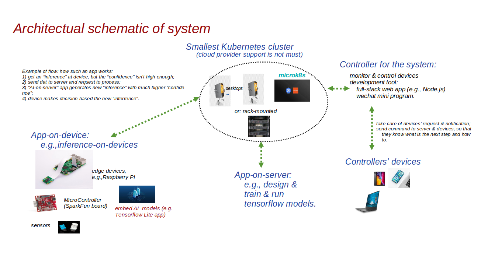

<div align="center">
  
  <br><br>
</div>
-----------------

**O**n my a few **previous projects**, 
such as, ["image recognition" (1)](https://github.com/huaxiaozhong1/tensorflow-lite-apps-on-raspberry-pi-3),  [(2)](https://github.com/huaxiaozhong1/complete-procedure-to-train-and-recognize-you-by-raspberry-pi-3-and-tensorflow-lite) and [(3)](https://github.com/huaxiaozhong1/YourOwnModel-TfLite-RaspberryPi), [**"speech recognization"**](https://github.com/huaxiaozhong1/Tensorflow-SparkFunEdge-FullLifeCycel-for-SequenceModel), and [**"watching sensor from web"**](https://github.com/huaxiaozhong1/Watching-Sensors-with-ESP32--Expressjs-Twilio-Sync-for-IoT), we implemented a few techniques of **IoT**, which we could summarize as **"AI on device"** and **"device supported by server"**.

**F**or quite a lot of realistic implementing around IoT devices, a reliable server-support is necessary. For example, thinking about an AI-on-device application, if "confidence" inferred on device isn't high enough, we'd better to send data to server for more powerful processing, then more accurate confidence could be calculated on server, and used on device eventually. 

**T**he kind of application was explored with [one of my projects](https://github.com/huaxiaozhong1/rails-tensorflow-image-recog-demo), indeed. Namely, the data (an image, on the case), which is to be processed intelligently, is sent to server that will be processed over there by an AI application, based on Tensorflow. Finally the client receives the result from server. 

**H**owever the project, mentioned above, just provided server applications as a solution. It didn't take care of necessary features of server itself. For example, if the server is put into real operation, it shall guarantee to run long-time without any exceptional stop. On the other words, it shall be a 
**high availability cluster**.

**M**orever some businesses, for example micro enterprises, require to deploy/control all resources of their running system efficiently, even if they have big client-volume, such as, IoT devices. So, such an on-premise solution will be required: all server software works in a closed cluster with all data stored inside. And very likely, they don't want to rely on supports from cloud provider. 

**I**n the project, we will walk through all the steps on: how to create a cluster providing an external access that any device could visit from out of the cluster, even if some machines organizing the cluster may be powered off.

**T**his project is implemented based on [Microk8s](https://microk8s.io/), which is "the smallest, fastest, fully-conformant" [Kubernetes](https://kubernetes.io/).

<div align="center">
  <br>
  
  <br>
</div>

### 1, Prepare machines

I **prepared** 4 PCs, on my case, to combine the cluster. These were the "machines" that I just found at my storage :-)

You may use more machines depending on your own option.

To access the cluster, another machine may be needed to run "http" request, which is out of the cluster. I prepared a raspberry Pi 3B+, on my case. 

### 2, Prepare test app

Supposing Ubuntu 18.04+ runs on your machines and docker.io is installed, the command "docker build" will create an app image, called "hello", by calling Dockerfile in sub-folder "hello". 

Check [the article](https://nodejs.org/fr/docs/guides/nodejs-docker-webapp/#dockerizing-a-node-js-web-app), for more details. The way we could "dockerize" an app image by "assembling" all necessary tools and environments that won't need to be installed into host anymore. The image, that is quite big, will be imported into coming cluster. 

Run the following commands at 4 machines that are to combine cluster. 

```
$ git clone https://github.com/huaxiaozhong1/microk8s-HA-cluster-no-support-from-cloud-provider.git
$ cd hello
$ sudo docker build -t hello.local .
...
```
A local docker image, which is named as "hello:local", is created. 

Save the image into a tarball:
```
$ sudo docker save hello:local > hello.local.tar
```
The procedure may need a few minutes.

### 3, Install microk8s

On every PC, install microk8s and necessary add-ons.

```
$ sudo snap install microk8s --channel=1.20/stable --classic 
```

The installation may get failed due to low speed of network connection. On the case, you need to download microk8s packages at first.

```
$ sudo snap download microk8s --channel=1.20/stable
```
The version of microk8s running on my cluster is v1.20.4-34+1ae8c29bbb48f7. You could check it after microk8s works.
```
$ microk8s kubectl version
```
The reversion that snap identifies is 2074. You could check it after microk8s is installed.
```
$ sudo snap list microk8s
```
So, if your downloading is successful, you could find 2 more files are added on the fold: microk8s_2074.assert and microk8s_2074.snap. Run the following commands to install:

```
$ sudo snap ack microk8s_2035.assert
$ sudo snap install microk8s_2035.snap --classic
```
**Note:** on worse case, the downloading may not be able to complete. Then you could contact to me to get the 2 file from me :-) The snap package is little bit big to uploaded to my git repository. 

Now, please check status until "microk8s is running".
```
$ microk8s status
microk8s is running
high-availability: no
  datastore master nodes: 192.168.0.100:19001 
  datastore standby nodes: none
addons:
  enabled:
  disabled:
    ambassador  
...
```
Run the following command, to check if all elements have become "ready". Especially, the sign of "READY" of each pod turn to be "1/1". 
```
$ microk8s kubectl get all --all-namespaces
NAMESPACE        NAME                                          READY   STATUS    RESTARTS   AGE
kube-system      pod/calico-node-q94vg                         1/1     Running   0          3m
...
```
It's possible that some pods don't get ready after a long time, as below:

```
$ microk8s kubectl get all --all-namespaces
NAMESPACE        NAME                                          READY   STATUS    RESTARTS   AGE
kube-system      pod/calico-node-q94vg                         0/1     Running   0          3m
...
```
If you meet such problem, just run the following command to check "why":

```
$ microk8s kubectl describe pod/calico-node-q94vg -n kube-system
Name:                 calico-node-q94vg
Namespace:            kube-system
...
... failed to pull image "k8s.gcr.io/pause:3.1": ...
...
```

Running the following command can know where to get the docker package.

```
$ sudo docker search pause
NAME                                 DESCRIPTION                                     STARS               OFFICIAL            AUTOMATED
mirrorgooglecontainers/pause-amd64                                                   19                                      
...                                       
```
Pull package "pause:3.1":

```
$ sudo docker pull mirrorgooglecontainers/pause-amd64:3.1
$ sudo docker tag mirrorgooglecontainers/pause-amd64:3.1 k8s.gcr.io/pause:3.1
```

Run the similar as we did at step 2:

```
$ sudo docker save k8s.gcr.io/pause:3.1 > pause.3.1.tar
```
Then, import the tarball into microk8s:

```
$ microk8s ctr image import pause.3.1.tar
```
Now, the READY of pod "calico-node-q94vg" should become "1/1" if you run "checking" as below:

```
$ microk8s kubectl get all --all-namespaces
NAMESPACE        NAME                                          READY   STATUS    RESTARTS   AGE
kube-system      pod/calico-node-q94vg                         1/1     Running   0          3m
...
```
If the pod still can't turn to "ready", stop/start microk8s as:
```
$ microk8s stop
$ microk8s start
```
Eventually it should be READY as "1/1". 

Now we have launched a fundamental microk8s cluster. Let's install some necessary addons at step 4 - 6.  

### 4, Enable addon "dns"

It is commonly required by other addons.
```
$ microk8s enable dns
...
$ microk8s status
...
$ microk8s kubectl get all --all-namespaces
NAMESPACE        NAME                                          READY   STATUS    RESTARTS   AGE
...
kube-system      pod/coredns-86f78bb79c-p554n                  1/1     Running   0          1m
...
```
Checking all elements' status as we did at step 3. When all elements reach READY as "1/1", go to step 5. 

### 5, Enable addon "ingress"

The addon will enable traffic to come into your Kubernetes cluster from outside.
```
$ microk8s enable ingress
```
As we did at step 3, check if the sign READY of the addon gets "1/1". 
```
$ microk8s status
...
$ microk8s kubectl get all --all-namespaces
...
```
You may find a pod of addon "ingress" does work.
```
microk8s kubectl get all --all-namespaces
...
ingress       pod/nginx-ingress-microk8s-controller-45tpn   0/1     ImagePullBackOff   0          2m7s
...
```
You could check details about the pod's status:
```
$ microk8s kubectl describe pod/nginx-ingress-microk8s-controller-45tpn -n ingress
...
Warning  Failed             12s (x2 over 57s)  kubelet            Failed to pull image "k8s.gcr.io/ingress-nginx/controller:v0.35.0": ...
...
```
Then, you may need to pull the image from other site:
```
sudo docker search ingress-nginx-controller
NAME                                                      DESCRIPTION                                     STARS               OFFICIAL            AUTOMATED
pollyduan/ingress-nginx-controller                        k8s.gcr.io/ingress-nginx/controller             4   
...
sudo docker pull pollyduan/ingress-nginx-controller:v0.35.0
...
sudo docker tag pollyduan/ingress-nginx-controller:v0.35.0 k8s.gcr.io/ingress-nginx/controller:v0.35.0
...
sudo docker save k8s.gcr.io/ingress-nginx/controller:v0.35.0 > ingress-nginx-controller.v0.35.tar
...
microk8s ctr image import ingress-nginx-controller.v0.35.tar
...
```
Now you could check all elements again. It is very likely that all of them are working.

**Note:** if you couldn't find any ingress image by calling "docker search", just contact to me. I can share it with you :-)

### 6, Enable add-on "metallb"

MetalLB allows you to create your own service in Kubernetes cluster. It is a "LoaderBalancer" service, which can distribute workload among all nodes inside cluster. As a result to work with "metallb", when you **launch an app** at a "physical" machine, it could be **open to external world** as "an IP address and an accessible port". It is the obvious advantage over some other clusters that have to work under support from "cloud providers", such as GCP, AWS, and etc. 

Now checking your physical router, to know the IP-address-pool that was set for machines and devices to connect. On my case, the pool ranges from 192.168.0.100 to 192.168.168.0.199. So, the 4 machines connected to the router have IPs as: 192.168.0.100 - 192.168.0.103.
Then, I would assign MetalLB an IP-address-pool as 192.168.0.120 - 192.168.0.127. So, the following command is typed:
```
microk8s enable metallb:192.168.0.120-192.168.0.127
```
Go through the similar way, that we did at step 5, to check and guarantee the addon works. 

On my case, a metallb pod will be created by pulling image "metallb/controller:v0.9.3". 

**Note:** if your pod meets issue with pulling the image, feel free to get the image from me.

### 7, Set up HA cluster

Select a node as **master node**. It is 192.168.0.100, on my case. Run the following command at the machine:
```
$ microk8s add-node
From the node you wish to join to this cluster, run the following:
microk8s join 192.168.0.100:25000/0e15febd53956674e8962a5240f08c3d
...
```
At all other machines, apply to join the cluster, run:
```
$ microk8s join 192.168.0.100:25000/0e15febd53956674e8962a5240f08c3d
...
```
Checking status by running:
```
$ microk8s status
microk8s is running
high-availability: yes
  datastore master nodes: 192.168.0.100:19001 192.168.0.101:19001 192.168.0.102:19001
  datastore standby nodes: 192.168.0.103:19001
...
```
It shows that there have been 3 **"datastore master nodes"** in this HA cluster. And there is 1 more node as **"datastore standby node"**.

As mentioned at steps above, you still need to check every elements' states so that we could know if all elements work.
```
$ microk8s kubectl get all --all-namespaces
...
```
At the time, you can also check all nodes' status by run:
```
$ microk8s kubectl get no
NAME                STATUS   ROLES    AGE   VERSION
node-102            Ready    <none>   9d    v1.20.2-34+350770ed07a558
node-100            Ready    <none>   10d   v1.20.2-34+350770ed07a558
node-103            Ready    <none>   9d    v1.20.4-34+1ae8c29bbb48f7
node-101            Ready    <none>   10d   v1.20.2-34+350770ed07a558
```
On my case, the 4 machines are all READY, at the end.

### 8, Deploy your own app in the cluster

We have built a web app at step 2. Now let's deploy it.
```
$ microk8s kubectl create deployment hello --image=hello:local
...
$ microk8s kubectl scale deployment hello --replicas=3
...
$ microk8s kubectl expose deployment hello --port=8081 --target-port=8080 --type=LoadBalancer --name=hello
...
```
After the 3 commands gets done, check the status of service expose as above:
```
microk8s kubectl get all --all-namespaces
...
NAMESPACE   NAME                 TYPE           CLUSTER-IP       EXTERNAL-IP     PORT(S)          AGE
default     service/kubernetes   ClusterIP      10.152.183.1     <none>          443/TCP          11d
default     service/hello        LoadBalancer   10.152.183.185   192.168.0.120   8081:31305/TCP   1m
...
```
Now we know that the service "hello" could be visited via external IP (192.168.0.120 on port 8081) from out of the cluster.

### 9, Verify the HA cluster

A machine, which is out of the cluster, will be used to visit an app exposed by the cluster.

On my case, a raspberry Pi 3B+, which doesn't join the cluster, is used to execute the test. It is connected to the same router that cluster's machines is connected to. Run the following command at the Pi:
```
$ curl http://192.168.0.120:8081
Hello World
```
Let's **power off** 192.168.0.100, the original **"master node"** we selected while setting the cluster up. 

Then, check cluster status again from any machine that is still working:
```
$microk8s status
microk8s is running
high-availability: yes
  datastore master nodes: 192.168.0.101:19001 192.168.0.102:19001 192.168.0.103:19001
  datastore standby nodes: none
...
```

Now we witness that **the cluster could be working continuously even if the original "master" node is shutdown!**

Try to access app "hello", from Pi, via 192.168.0.120 (with port 8081) again:
```
$ curl http://192.168.0.120:8081
Hello World
```
It is verified that the app's IP, exposed by cluster, does continuously work. It is not influenced with the original "master" node stops working.

The machine of 192.168.0.100 will come back to work as soon as it is powered on again.

### 10, Main goals

The repository is to create a cluster, which will reach main goals as below.

#### 10.1, 

To run the cluster, with **no support from cloud providers**, such as GCE, AWS, is not must.

#### 10.2, 

The cluster is a high-available (HA) platform to reliably run with **no interrupt when some nodes stop working**. So, it is pretty much suitable for micro enterprises to develop their internet-based business, to support their remote customers' devices. For example, a family of IoT devices which are running AI apps on remote sites, request inference for some objects in much higher "confidence". At the time, the cluster could work for these devices remotely.

#### 10.3, 

We could develop, deploy and maintain the kind of service in **efficient resource and cost**.

### 11, To-dos

[Microk8s](https://microk8s.io/docs) does aim to provide "the best **production grade Kubernetes** for application". So our solution shall implement the following features.

#### 11.1, 

Implement security policy for the cluster access, such as, authentication and authorization.

#### 11.2,

Publish application service based on "hosting" and "domain name" support, through which IoT devices, from anywhere in the world, could access our apps exposed by the cluster.

#### 11.3,

Based on my existing example apps, for example - [AI-on-device](https://github.com/huaxiaozhong1/complete-procedure-to-train-and-recognize-you-by-raspberry-pi-3-and-tensorflow-lite) and [AI-on-server](https://github.com/huaxiaozhong1/rails-tensorflow-image-recog-demo), implement a system that all applications run cross-working between devices and server. The deives all link to the cluster, which server apps are working inside.  

### 11.4,

Enable addon [OpenEBS](https://microk8s.io/docs/addon-openebs), in order to implement "storage capability" for the multi-node cluster.

### <span style="color: green"> 12, The system if implemented </span>

<div align="center">
  
  <br><br>
</div>

